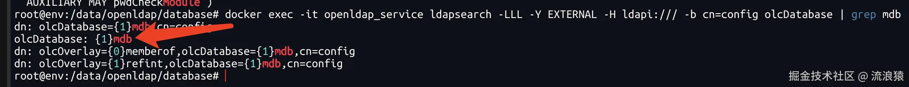

# 部署openldap

## 环境准备：

ubuntu-20.04.6
docker
docker-compose

## 正式开始
### 1. 安装docker和docker-compose

```bash
创建容器需要的目录

mkdir /data/openldap/database -p #数据存储的目录
mkdir /data/openldap/config -p #放置配置文件的目录
mkdir /data/openldap/certs -p #证书目录
```


docker-compose部署ldap-services和管理界面，进入ldap目录 cd /data/openldap,创建编排文件vim openldap.yaml

执行部署命令: docker-compose -f openldap.yaml up -d

打开web控制台页面,地址:http://IP:8090

Login项 填入配置的LDAP_ADMIN_USERNAME和LDAP_ROOT：cn=admin,dc=xxx,dc=com，Password项 填入配置的密码LDAP_ADMIN_PASSWORD：123456,点击Authenticate 登录成功后就可以愉快的玩耍啦~~~


### 2.开启memberof

```bash
cd /data/openldap/database

vim add_memberof_module.ldif

```

```ldif
dn: cn=module,cn=config
cn: module
objectClass: olcModuleList
olcModulePath: /var/lib/ldap

dn: cn=module{0},cn=config
changetype: modify
add: olcModuleLoad
olcModuleLoad: memberof.la

```

```shell
docker exec -it openldap_service ldapadd -Q -Y EXTERNAL -H ldapi:/// -f /var/lib/ldap/add_memberof_module.ldif
```

查看mdb库的下标 
`docker exec -it openldap_service ldapsearch -LLL -Y EXTERNAL -H ldapi:/// -b cn=config olcDatabase | grep mdb`



进入目录 `/data/openldap/database` 创建文件 `vim add_groupofnames_module.ldif` 内容如下:
```
# dn: olcOverlay=memberof,olcDatabase={1}mdb,cn=config <------我这里是{1}mdb 
dn: olcOverlay=memberof,olcDatabase={1}mdb,cn=config
objectClass: olcConfig
objectClass: olcMemberOf
objectClass: olcOverlayConfig
objectClass: top
olcOverlay: memberof
olcMemberOfDangling: ignore
olcMemberOfRefInt: TRUE
olcMemberOfGroupOC: groupOfNames
olcMemberOfMemberAD: member     
olcMemberOfMemberOfAD: memberOf

```

执行 `docker exec -it openldap_service ldapadd -Q -Y EXTERNAL -H ldapi:/// -f /var/lib/ldap/add_groupofnames_module.ldif` 
出现以下提示添加成功


