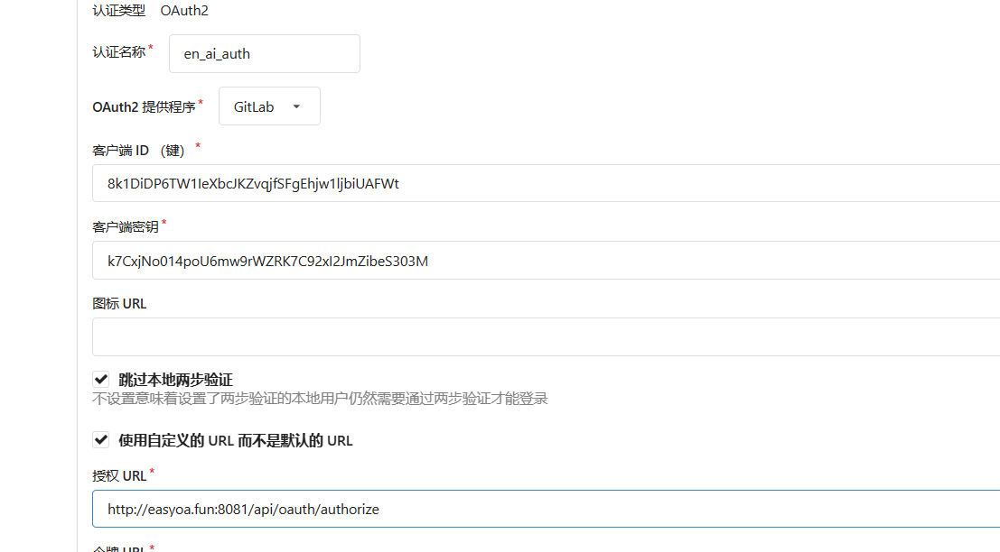

# OAUTH2

## 本平台目前oauth2服务器兼容qq和gitlab规范！使用无需关注细节，按照相应的选项接入即可。

例如：

# 1.仿QQ Oauth 服务端-方便国内产品接入本平台

## 1. 简介

OAuth2.0 是目前最流行的授权协议之一，它允许用户让第三方应用访问用户的账户信息，而无需将用户名和密码提供给第三方应用。

## 2. 授权流程

### 2.1 授权码模式

#### 2.1.1 授权码的获取

用户访问客户端，后者将用户导向授权服务器的授权页面，并在其中填写客户端的相关信息

```
GET /authorize?response_type=code&client_id=CLIENT_ID&redirect_uri=REDIRECT_URI&scope=SCOPE&state=STATE HTTP/1.1
Host: server.example.com
```

| 参数            | 是否必须 | 含义                                                                                                                                                                                                    |
|---------------|------|-------------------------------------------------------------------------------------------------------------------------------------------------------------------------------------------------------|
| response_type | 必须   | 授权类型，此值固定为“code”。                                                                                                                                                                                     |
| client_id     | 必须   | 申请QQ登录成功后，分配给应用的appid。                                                                                                                                                                                |
| redirect_uri  | 必须   | 成功授权后的回调地址，必须是注册appid时填写的主域名下的地址，建议设置为网站首页或网站的用户中心。注意需要将url进行URLEncode。                                                                                                                               |
| state         | 必须   | client端的状态值。用于第三方应用防止CSRF攻击，成功授权后回调时会原样带回。请务必严格按照流程检查用户与state参数状态的绑定。                                                                                                                                 |
| scope         | 可选   | 请求用户授权时向用户显示的可进行授权的列表。<br/>可填写的值是[API文档]中列出的接口，如果要填写多个接口名称，请用逗号隔开。<br/>例如：scope=get_user_info,list_album,upload_pic<br/>不传则默认请求对接口get_user_info进行授权。<br/>建议控制授权项的数量，只传入必要的接口名称，因为授权项越多，用户越可能拒绝进行任何授权。 |
| display       | 可选   | 仅**PC网站**接入时使用。<br/>用于展示的样式。不传则默认展示为PC下的样式。<br/>如果传入“mobile”，则展示为mobile端下的样式。                                                                                                                         |

#### 2.1.2 授权码的使用

用户在授权页面中输入用户名和密码，并同意授权，授权服务器将用户导向客户端的回调地址，并在其中包含授权码

```
GET /token HTTP/1.1
Host: server.example.com
Content-Type: application/x-www-form-urlencoded

grant_type=authorization_code&code=CODE&redirect_uri=REDIRECT_URI&client_id=CLIENT_ID&client_secret=CLIENT_SECRET
```

| 参数            | 是否必须 | 含义                                                                                                                                                                                                      |
|---------------|------|---------------------------------------------------------------------------------------------------------------------------------------------------------------------------------------------------------|
| grant_type    | 必须   | 授权类型，在本步骤中，此值为“authorization_code”。                                                                                                                                                                     |
| client_id     | 必须   | 申请后，分配给网站的client_id。                                                                                                                                                                                    |
| client_secret | 必须   | 分配给网站的client_secret。                                                                                                                                                                                    |
| code          | 必须   | 上一步返回的authorization code。<br/>如果用户成功登录并授权，则会跳转到指定的回调地址，并在URL中带上Authorization Code。<br/>例如，回调地址为www.qq.com/my.php，则跳转到：<br/>http://www.qq.com/my.php?code=520DD95263C1CFEA087******<br/>注意此code会在1分钟内过期。 |
| redirect_uri  | 必须   | 与上面一步中传入的redirect_uri保持一致。                                                                                                                                                                              |
|               |      |                                                                                                                                                                                                         |
|               |      |                                                                                                                                                                                                         |

##### **返回说明**：

如果成功返回，即可在返回包中获取到Access Token。 如：

access_token=FE04************************CCE2&expires_in=7776000&refresh_token=88E4************************BE14

| **参数说明**      | **描述**                               |
|---------------|--------------------------------------|
| access_token  | 授权令牌，Access_Token。                   |
| expires_in    | 该access token的有效期，单位为秒。              |
| refresh_token | 在授权自动续期步骤中，获取新的Access_Token时需要提供的参数。 |

#### 2.1.3 刷新令牌(可选)

在授权码模式中，授权服务器可能会返回一个刷新令牌，客户端可以使用该令牌来获取新的访问令牌

Access_Token的有效期默认是90天，过期后需要用户重新授权才能获得新的Access_Token。本步骤可以实现授权自动续期，避免要求用户再次授权的操作，提升用户体验。
**请求地址**：
PC网站：https://graph.qq.com/oauth2.0/token
**请求方法**：
GET
**请求参数**：
请求参数请包含如下内容：

|      参数       | 是否必须 |                                                                                                      含义                                                                                                      |
|:-------------:|:----:|:------------------------------------------------------------------------------------------------------------------------------------------------------------------------------------------------------------:|
|  grant_type   |  必须  |                                                                                        授权类型，在本步骤中，此值为“refresh_token”。                                                                                        |
|   client_id   |  必须  |                                                                                            申请QQ登录成功后，分配给网站的appid。                                                                                            |
| client_secret |  必须  |                                                                                           申请QQ登录成功后，分配给网站的appkey。                                                                                            |
| refresh_token |  必须  | 首次：使用在[Step2](https://wiki.connect.qq.com/使用authorization_code获取access_token#Step2.EF.BC.9A.E9.80.9A.E8.BF.87AuthorizationCode.E8.8E.B7.E5.8F.96AccessToken)中获取到的最新的refresh_token。后续：使用刷新后返回的最新refresh_token |
|      fmt      |  可选  |                                                                             因历史原因，默认是x-www-form-urlencoded格式，如果填写json，则返回json格式                                                                              |

**返回说明**：
如果成功返回，即可在返回包中获取到Access Token。 如(不指定fmt时）：
access_token=FE04************************CCE2&expires_in=7776000&refresh_token=88E4************************BE14。

|   **参数说明**    |                                               **描述**                                                |
|:-------------:|:---------------------------------------------------------------------------------------------------:|
| access_token  |                                         授权令牌，Access_Token。                                          |
|  expires_in   |                                       该access token的有效期，单位为秒。                                       |
| refresh_token | 在授权自动续期步骤中，获取新的Access_Token时需要提供的参数。每次生成最新的refresh_token，且仅一次有效，一次登录，refresh_token整个续票过程，最长有效期：6个月。 |

#### 2.1.4 获取用户OpenID_OAuth2.0

**本步骤的作用**：
通过输入在上一步获取的Access Token，得到对应用户身份的OpenID。
OpenID是此网站上或应用中唯一对应用户身份的标识，网站或应用可将此ID进行存储，便于用户下次登录时辨识其身份，或将其与用户在网站上或应用中的原有账号进行绑定。

##### 1 请求地址

PC网站：https://10.15.247.254:55550/oauth2.0/me

##### 2 请求方法

GET

##### 3 请求参数

请求参数请包含如下内容：

|      参数      | 是否必须 |                  含义                  |
|:------------:|:----:|:------------------------------------:|
| access_token |  必须  |       在Step1中获取到的access token。       |
|     fmt      |  可选  | 因历史原因，默认是jsonpb格式，如果填写json，则返回json格式 |

##### 4 返回说明

PC网站接入时，获取到用户OpenID，返回包如下（如果fmt参数未指定)：

```
callback( {"client_id":"YOUR_APPID","openid":"YOUR_OPENID"} );
```

openid是此网站上唯一对应用户身份的标识，网站可将此ID进行存储便于用户下次登录时辨识其身份，或将其与用户在网站上的原有账号进行绑定。

## 3. Scope可取值文档

##### 声明:

默认具有访问`/me`接口的权限，无需传入，该接口返回openid

| **分组名称** | **适用平台** | **API接口**     | **功能说明**             | **备注** |
|----------|----------|---------------|----------------------|--------|
| 访问用户资料   |          | get_user_info | 获取登录用户的昵称、头像、性别等基本信息 |        |

## 4.API详细文档

1. 以[get_user_info](https://wiki.connect.qq.com/get_user_info)接口为例：
   （请将access_token，appid等参数值替换为你自己的）

https://graph.qq.com/user/get_user_info?access_token=YOUR_ACCESS_TOKEN&oauth_consumer_key=YOUR_APP_ID&openid=YOUR_OPENID

2. 成功返回后，即可获取到用户数据：

```
{
   "code":0,
   "msg":"",
   "nickname":"YOUR_NICK_NAME",
   "sex":"性别",
   "avatar":"头像",
   "e"
  ...
}
```

## 5.公共错误码

##### **错误码说明**：

接口调用有错误时，会返回code和msg字段，以url参数对的形式返回，value部分会进行url编码（UTF-8）。
PC网站接入时，错误码详细信息请参见：

|  错误码   |                                                                                                                                         含义说明                                                                                                                                         |
|:------:|:------------------------------------------------------------------------------------------------------------------------------------------------------------------------------------------------------------------------------------------------------------------------------------:|
|   0    |                                                                                                                                         成功。                                                                                                                                          |
| 100000 |                                                                                                                          缺少参数response_type或response_type非法。                                                                                                                          |
| 100001 |                                                                                                                                    缺少参数client_id。                                                                                                                                    |
| 100002 |                                                                                                                                  缺少参数client_secret。                                                                                                                                  |
| 100003 |                                                                                                                              http head中缺少Authorization。                                                                                                                              |
| 100004 |                                                                                                                             缺少参数grant_type或grant_type非法。                                                                                                                             |
| 100005 |                                                                                                                                      缺少参数code。                                                                                                                                       |
| 100006 |                                                                                                                                   缺少refresh token。                                                                                                                                   |
| 100007 |                                                                                                                                   缺少access token。                                                                                                                                    |
| 100008 |                                                                                                                                      该appid不存在。                                                                                                                                      |
| 100009 |                                                                                                                              client_secret（即appkey）非法。                                                                                                                               |
| 100010 |                                                                                                      回调地址不合法，常见原因请见：[回调地址常见问题及修改方法](https://wiki.connect.qq.com/回调地址常见问题及修改方法)                                                                                                       |
| 100011 |                                                                                                                                     APP不处于上线状态。                                                                                                                                      |
| 100012 |                                                                                                                                    HTTP请求非post方式。                                                                                                                                    |
| 100013 |                                                                                                                            access token失效（用户取消授权或过期被回收）。                                                                                                                             |
| 100014 | access token过期。 token过期时间为90天。如果存储的access token过期，请重新走登录流程，根据[使用Authorization_Code获取Access_Token](https://wiki.connect.qq.com/使用authorization_code获取access_token)或[使用Implicit_Grant方式获取Access_Token](https://wiki.connect.qq.com/使用implicit_grant方式获取access_token)获取新的access token值。 |
| 100015 |         access token废除。 token被回收，或者被用户删除。请重新走登录流程，根据[使用Authorization_Code获取Access_Token](https://wiki.connect.qq.com/使用authorization_code获取access_token)或[使用Implicit_Grant方式获取Access_Token](https://wiki.connect.qq.com/使用implicit_grant方式获取access_token)获取新的access token值。          |
| 100016 |                                                                                                                                  access token验证失败。                                                                                                                                   |
| 100017 |                                                                                                                                      获取appid失败。                                                                                                                                      |
| 100018 |                                                                                                                                      获取code值失败。                                                                                                                                      |
| 100019 |                                                                                                                               用code换取access token值失败。                                                                                                                                |
| 100020 |                                                                                                            code被重复使用。code是一次性有效的，开发者此时应该引导用户重新登录授权，重新获取code，而不是重试token接口                                                                                                             |
| 100021 |                                                                                                          获取access token值失败。注：refresh_token仅一次有效，每次续票成功，都会返回最新的refrush_token                                                                                                          |
| 100022 |                                                                                                                                 获取refresh token值失败。                                                                                                                                  |
| 100023 |                                                                                                                                   获取app具有的权限列表失败。                                                                                                                                    |
| 100024 |                                                                                                                               获取某OpenID对某appid的权限列表失败。                                                                                                                               |
| 100025 |                                                                                                                                  获取全量api信息、全量分组信息。                                                                                                                                   |
| 100026 |                                                                                                                                 设置用户对某app授权api列表失败。                                                                                                                                  |
| 100027 |                                                                                                                                   设置用户对某app授权时间失败。                                                                                                                                   |
| 100028 |                                                                                                                                      缺少参数which。                                                                                                                                      |
| 100029 |                                                                                                                                      错误的http请求。                                                                                                                                      |
| 100030 |                                                                                                               用户没有对该api进行授权，或用户在腾讯侧删除了该api的权限。请用户重新走登录、授权流程，对该api进行授权。                                                                                                               |
| 100031 |                                                                                                   第三方应用没有对该api操作的权限。请发送邮件进行[OpenAPI权限申请](https://wiki.connect.qq.com/openapi权限申请)。                                                                                                   |
| 100032 |                                                                                                                                    过载，一开始未细分时可以用。                                                                                                                                    |
| 100033 |                                                                                                                                       缺少UIN参数。                                                                                                                                       |
| 100034 |                                                                                                                                      缺少skey参数。                                                                                                                                       |
| 100035 |                                                                                                                                        用户未登陆。                                                                                                                                        |
| 100036 |                                                                                                                                   RefreshToken失效。                                                                                                                                    |
| 100037 |                                                                                                                                   RefreshToken已过期                                                                                                                                    |
| 100038 |                                                                                                                                   RefreshToken已废除                                                                                                                                    |
| 100039 |                                                                                                                                 RefreshToken到达调用上限。                                                                                                                                  |
| 100040 |                                                                                                                                RefreshToken的AppKey非法。                                                                                                                                |
| 100041 |                                                                                                                                RefreshToken,AppID非法。                                                                                                                                 |
| 100042 |                                                                                                                                   RefreshToken非法。                                                                                                                                    |
| 100043 |                                                                                                                                      APP处于暂停状态。                                                                                                                                      |
| 100044 |                                                                                                                           错误的sign，Md5校验失败，请求签名与官网填写的签名不一致。                                                                                                                           |
| 100045 |                                                                                                                                     用户改密token失效。                                                                                                                                     |
| 100046 |                                                                                                                                      g_tk校验失败。                                                                                                                                       |
| 100048 |                                                                                                                                    没有设置companyID。                                                                                                                                    |
| 100049 |                                                                                                                               APPID没有权限(get_unionid)。                                                                                                                                |
| 100050 |                                                                                                                            OPENID解密失败，一般是openid和appid不匹配。                                                                                                                            |
| 100051 |                                                                                                                                       调试模式无权限。                                                                                                                                       |
|        |                                                                                                                                                                                                                                                                                      |
| 100052 |                                                                                                                              APPID没有权限获取paytoken和openid                                                                                                                              |
| 100053 |                                                                                                                                    ip没有权限获取用户登录信息                                                                                                                                    |
| 100054 |                                                                                                                                  查询用户近期登录记录时缺少uin参数                                                                                                                                  |
| 100055 |                                                                                                                                      查询用户授权信息失败                                                                                                                                      |
| 100056 |                                                                                                                                     该用户近期没有授权记录                                                                                                                                      |
| 100057 |                                                                                                                             APPID没有使用skey换code或token的权限                                                                                                                              |
| 100058 |                                                                                                                                       openid非法                                                                                                                                       |
| 100059 |                                                                                                                                      ip没有权限使用接口                                                                                                                                      |
| 100060 |                                                                                                                                         禁止登录                                                                                                                                         |
| 100061 |                                                                                                                                      非法apptoken                                                                                                                                      |
| 100062 |                                                                                                                                        应用频率限制                                                                                                                                        |
| 100063 |                                                                                                                                      获取openid失败                                                                                                                                      |
| 100065 |                                                                                                                                  获取delegatetoken失败                                                                                                                                   |
| 100066 |                                                                                                                                 没有权限获取delegatetoken                                                                                                                                  |
| 100067 |                                                                                                                                        code过期                                                                                                                                        |
| 100068 |                                                                                                                                        非法code                                                                                                                                        |
| 110401 |                                                                                                                                      请求的应用不存在。                                                                                                                                       |
| 110404 |                                                                                                                                     请求参数缺少appid。                                                                                                                                     |
| 110405 |                                                                                                                                   登录请求被限制，请稍后在登录。                                                                                                                                    |
| 110406 |                                                                                                                                      应用没有通过审核。                                                                                                                                       |
| 110500 |                                                                                                                                     获取用户授权信息失败。                                                                                                                                      |
| 110501 |                                                                                                                                     获取应用的授权信息失败                                                                                                                                      |
| 110502 |                                                                                                                                       设置用户授权失败                                                                                                                                       |
| 110503 |                                                                                                                                      获取token失败                                                                                                                                       |
| 110504 |                                                                                                                                        系统内部错误                                                                                                                                        |
| 110505 |                                                                                                                                         参数错误                                                                                                                                         |
| 110506 |                                                                                                                                    获取APP info信息失败                                                                                                                                    |
| 110507 |                                                                                                                                  校验APP info 签名信息失败                                                                                                                                   |
| 110508 |                                                                                                                                       获取code失败                                                                                                                                       |
| 110509 |                                                                                                                                       SKEY校验失败                                                                                                                                       |
| 110510 |                                                                                                                                       Disable                                                                                                                                        |

##### 公共返回码-for 网站验证失败

|  错误码   |                  含义说明                   |
|:------:|:---------------------------------------:|
| 100001 | 网站url格式不正确（网站url长度不能超过256，网站url只能有二级目录） |
| 100003 |                服务器连接超时。                 |
| 103001 |         网站的mete信息和QQ提供的验证信息不一致。         |
| 103002 |             网站不能使用IP地址和端口号。             |

# 2.仿gitlab Oauth服务端接口设计-方便国外应用接入