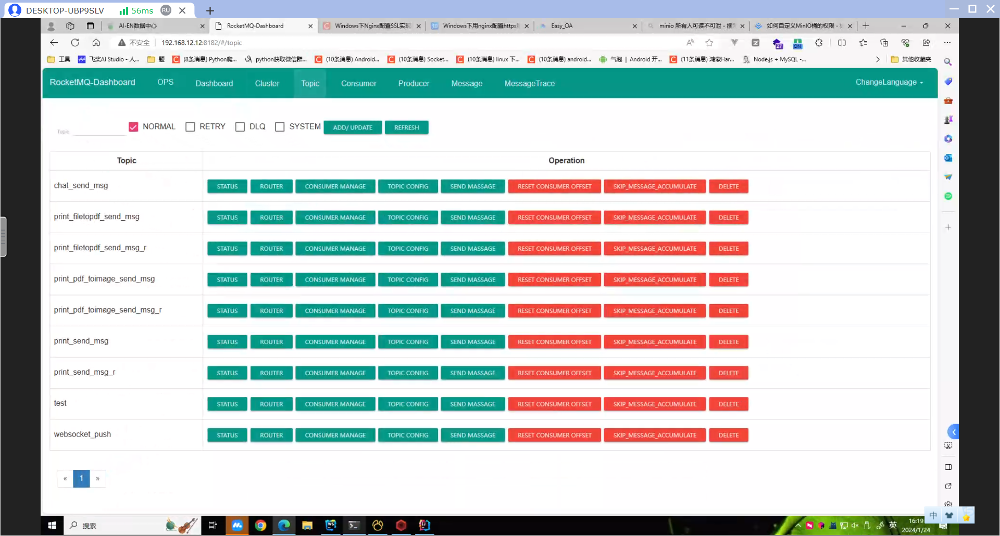

# AI综合服务平台

### Version：1.8.0

## 环境准备

- rabbitmq v5 推荐docker安装 单体文件太多[必须安装]
- redis v8 [必须安装]
- consul v1.15.4 [必须安装]
- mysql8.0.20 [必须安装]
- minio 最新版即可 [必须安装]


- [Easy_OA服务平台主后端](https://github.com/abbhb/OA_Helper)
- [Easy_OA前端](https://github.com/abbhb/OA_Helper-Vue)
- [AI服务平台打印节点服务](https://github.com/abbhb/PrintNode)

## 运行

直接maven拉一下依赖
运行即可

```text
注意:如果是java8以上版本需要加上VM参数,不然可能出现报错
一些反射找不到(但我现在没加也没报错)

mybatisplus堆栈溢出可能是
继承mybatis重写方法写了this，成了循环调用，引发堆栈溢出
改this为super即可！
```

#### 权限规定

list为菜单权限整个页面批量数据权限
query为单个数据权限 结合角色数据限制来查询
add 添加权限
delete 删除权限
update 修改权限

## 注意:

+ swagger在上线前最好关掉 在主函数上注释掉注解即可
+ minio 报连接错误可能是时区问题，minio需要美国1时区
+ token 存在cookies 方便管理
+ 避坑：mysql8 key value不能作为字段名
+ 打印如需要接入，需要结合打印节点服务这个项目，或者根据打印的文档来手动实现打印的rocketmq端和打印机状态api注册等等

## 项目说明

- 项目采用springboot2.2.6 + mybatis-plus + vue + mysql8.0.20 + redis8.0.20 + rabbitmq5.7.16 + minio最新版
- 项目采用前后端分离架构，后端采用springboot2.2.6 + mybatis-plus + spring-security-oauth2 + vue + mysql8.0.20 + redis8.0

## 初始化项目：【必须】

创建superadmin角色,id必须为1L
创建一个用户名为admin的用户，为该用户绑定1L的角色
升级为直接执行docs文件夹里的init.sql即可!

注意：

+ 项目启动时会自动初始化数据库，如果数据库中已经存在数据，则会删除重建，如果数据库中没有数据，则会自动初始化
+ 项目启动时会自动初始化redis，如果redis中已经存在数据，则会删除重建，如果redis中没有数据，则会自动初始化
+ 代码多处的桶名称写死，如果改了桶名称aistudio也得改，全局搜索修改

## rocketmq里的队列需要手动创建并修改springboot的配置

当前部署示例



### topic 详细配置

#### 注意dev和prod用的是两套环境，具体请自己研究配置文件

topicname: writeQueueNums readQueueNums perm
chat_send_msg:16 16 6
print_filetopdf_send_msg:16 16 6
print_filetopdf_send_msg_r:16 16 6
print_pdf_toimage_send_msg:16 16 6
print_pdf_toimage_send_msg_r:16 16 6
print_send_msg    :16 16 6
print_send_msg_r:16 16 6
websocket_push:4 4 6
test:16 16 6

